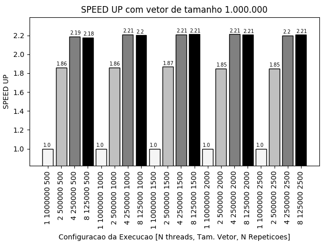

* Nome: Bruno da Silva Alves.
* Nome da disciplina: Programação Paralela elc139-2019a

## Parte I: Pthreads

##### 1. Explique como se encontram implementadas as 4 etapas de projeto: particionamento, comunicação, aglomeração, mapeamento (use trechos de código para ilustrar a explicação).

  - Particionamento: É a decomposição do problema em pequenas tarefas [1].

É possível notar a etapa de particionamento no seguinte trecho de código:

```c
// A tarefa de executar um produto escalar é particionada em várias pequenas tarefas.
// Agora, para se executar um prod. escalar é preciso realizar várias
// tarefas que calculam a multiplicação entre os valores das matrizes e
// realizam as somas parciais desses valores.

void *dotprod_worker(void *arg)
{
   int i, k;
   long offset = (long) arg;
   double *a = dotdata.a;
   double *b = dotdata.b;     
   int wsize = dotdata.wsize;
   int start = offset*wsize;
   int end = start + wsize;
   double mysum;

   // Pequena tarefa executada em cada thread.
   for (k = 0; k < dotdata.repeat; k++) {
      mysum = 0.0;
      for (i = start; i < end ; i++)  {
        // Somas parciais realizada por cada tarefa.
         mysum += (a[i] * b[i]);
      }
   }

   pthread_mutex_lock (&mutexsum);
   dotdata.c += mysum;
   pthread_mutex_unlock (&mutexsum);

   pthread_exit((void*) 0);
}
```


  - Comunicação: É a determinação das estruturas e algoritmos necessários para a comunicação [1].

  ```c
  // Nesse trecho de código a estrutura para a comunicação entre as tarefas
  // é determinada. As threads irão se comunicar por meio de uma struct
  // que contêm a matriz A, a matriz B e o resultado do prod. escalar C. Ainda,
  // um mutex é iniciado, o mesmo define uma política de acesso a informação
  // entre as threads.
  typedef struct
   {
     double *a;
     double *b;
     double c;
     int wsize;
     int repeat;
   } dotdata_t;

  // Variaveis globais, acessiveis por todas threads
  dotdata_t dotdata;
  pthread_mutex_t mutexsum;
  ```
  ```c
  // Nesse trecho onde a fase da aglomeração é realizada, é possível perceber
  // a presença da comunicação entre as threads, pois o uso do mutex faz com que
  // as threads se comuniquem e sincronizem o acesso à variável C.
  // Linhas 45 - 47 do código.
  pthread_mutex_lock (&mutexsum);
  dotdata.c += mysum;
  pthread_mutex_unlock (&mutexsum);
  ```

  - Aglomeração: É a possível combinação de tarefas em tarefas maiores para o aumento de desempenho e diminuição de custos na comunicação [1].

  ```c
  // Aqui é possível perceber a fase de aglomeração, pois os resultados parciais
  // calculados por cada thread são somados à variável dotdata.c.

  // O cálculo da soma parcial é realizado:
  for (k = 0; k < dotdata.repeat; k++) {
     mysum = 0.0;
     for (i = start; i < end ; i++)  {
        mysum += (a[i] * b[i]);
     }
  }

  // E então "aglomerado" ao resultado final:
  pthread_mutex_lock (&mutexsum);
  dotdata.c += mysum;
  pthread_mutex_unlock (&mutexsum);
  ```

    - Mapeamento: É a distribuição de tarefas aos processadores.

    ```c
    // A função dotprod_threads (chamada pela main) define como as tarefas serão
    // distribuídas para cada thread.

    void dotprod_threads(int nthreads)
    {
       int i;
       pthread_t *threads;
       pthread_attr_t attr;

       threads = (pthread_t *) malloc(nthreads * sizeof(pthread_t));
       pthread_mutex_init(&mutexsum, NULL);

       pthread_attr_init(&attr);
       pthread_attr_setdetachstate(&attr, PTHREAD_CREATE_JOINABLE);

       // Aqui, a tarefa é distribuída para nthreads. A tarefa a ser
       // realizada por cada thread é descrita pela função dotprod_worker().  
       for (i = 0; i < nthreads; i++) {
          pthread_create(&threads[i], &attr, dotprod_worker, (void *) i);
       }
       pthread_attr_destroy(&attr);
       for (i = 0; i < nthreads; i++) {
          pthread_join(threads[i], NULL);
       }
       free(threads);
    }
    ```
##### 2. Considerando o tempo (em microssegundos) mostrado na saída do programa, qual foi a aceleração (speedup) com o uso de threads?

 - Considerando a execução do cenário descrito abaixo, a aceleração encontrada foi de ~1.85.

 ```
  ./pthreads_dotprod 1 1000000 2000
  ./pthreads_dotprod 2 500000 2000
 ```


##### 3. A aceleração  se sustenta para outros tamanhos de vetores, números de threads e repetições? Para responder a essa questão, você terá que realizar diversas execuções, variando o tamanho do problema (tamanho dos vetores e número de repetições) e o número de threads (1, 2, 4, 8..., dependendo do número de núcleos). Cada caso deve ser executado várias vezes, para depois calcular-se um tempo de processamento médio para cada caso. Atenção aos fatores que podem interferir na confiabilidade da medição: uso compartilhado do computador, tempos muito pequenos, etc.

  - Para responder essa questão foi calculado a média de 20 execuções para cada configuração testada. As configurações testadas e as médias calculadas estão em [results.csv](results.csv). Os valores de aceleração calculados encontram-se nos seguintes arquivos [1_mil_spdup](pthreads_dotprod/1_mil/result_speedup.csv), [10_mil_spdup](pthreads_dotprod/10_mil/result_speedup.csv), [100_mil_spdup](pthreads_dotprod/100_mil/result_speedup.csv), [1_milhao_spdup](pthreads_dotprod/1_milhao/result_speedup.csv) (e graficamente nas tabelas da questão 4). A tabela abaixo mostra que os valores de aceleração tendem a aumentar conforme o tamanho do vetor, o número de repetições e o número de threads aumentam. Os melhores speedups obtidos foram com o uso de 4 threads, esse resultado era esperado pois o hardware testado possui 2 cores com 2 threads cada. Também é possível observar que o maior speedup entre todos os testes realizados foi o do cenário com 4 threads, tamanho do vetor igual a 250000 e com 2000 repetições. Os resultados obtidos com a utilização de 8 threads, em geral, foram levemente piores do que o uso de 4 threads, assim demonstrando a sobrecarga causada pela criação e mantimento de mais threads do que as suportadas pelo hardware.

| Tamanho base do vetor  |  Mínimo Speedup |  Máximo Speedup |
|---|---|---|
| 1.000  | Speedup = 1.33. Cenário: 2 threads, Tam = 500, Rep = 1000 | Speedup = 1.97. Cenário: 4 threads, Tam = 250, Rep = 2500  |  
| 10.000 | Speedup = 1.56. Cenário: 2 threads, Tam = 5000, Rep = 500  | Speedup = 2.18. Cenário: 4 threads, Tam = 2500, Rep = 1500  |  
| 100.000  | Speedup = 1.71. Cenário: 2 threads, Tam = 50000, Rep = 1000  |  Speedup = 2.2. Cenário: 4 threads, Tam = 25000, Rep = 2000 |   
| 1.000.000  |  Speedup = 1.848. Cenário: 2 threads, Tam = 500000, Rep = 2000 | Speedup = 2.2116. Cenário: 4 threads, Tam = 250000, Rep = 2000  |   


##### 4. Elabore um gráfico/tabela de aceleração a partir dos dados obtidos no exercício anterior.




##### 5. Explique as diferenças entre [pthreads_dotprod.c](pthreads_dotprod/pthreads_dotprod.c) e [pthreads_dotprod2.c](pthreads_dotprod/pthreads_dotprod2.c). Com as linhas removidas, o programa está correto?

 - A diferença entre pthreads_dotprod.c e o pthreads_dotprod2.c está no uso do mutex na fase de aglomeração do resultado, enquanto que o pthreads_dotprod.c faz o uso do mutex, o código do pthreads_dotprod2.c não utiliza. O programa não está correto, pois podem ocorrer erros no resultado final obtido devido à falta de sincronização gerando uma condição de corrida (race condition).


Referências:
- [1] Cláudio Geyer. Programação Paralela:Uma Introdução a MPI. ftp://ftp.inf.ufrgs.br/pub/geyer/PDP-CIC-ECP/slidesAlunos/SemestresAnteriores/ProvaP2-2017-1/pp03-tecnicas-MPI-Andre-v1d3-jun2017-gdocs.pdf.
- Autor. Título. Link.

------
## Parte II: OpenMP

##### 1. Implemente um programa equivalente a [pthreads_dotprod.c](pthreads_dotprod/pthreads_dotprod.c) usando OpenMP.

  - [Código completo do programa](openmp/ompsimple.c).

```c
int main(int argc, char **argv){

  int nthreads, wsize, repeat;
  long start_time, end_time;

  if ((argc != 4)) {
     printf("Uso: %s <nthreads> <worksize> <repetitions>\n", argv[0]);
     exit(EXIT_FAILURE);
  }

  nthreads = atoi(argv[1]);
  wsize = atoi(argv[2]);  // worksize = tamanho do vetor de cada thread
  repeat = atoi(argv[3]); // numero de repeticoes dos calculos (para aumentar carga)

  dotdata_t dotdata;

  // Cria vetores
  dotdata.a = (double *) malloc(wsize*nthreads*sizeof(double));
  fill(dotdata.a, wsize*nthreads, 0.01);
  dotdata.b = (double *) malloc(wsize*nthreads*sizeof(double));
  fill(dotdata.b, wsize*nthreads, 1.0);
  dotdata.c = 0.0;
  dotdata.wsize = wsize;
  dotdata.repeat = repeat;

  // Variavel que controla o offset
  int arg = -1;
  // Seta o número de threads de acordo com o argv[1] informado
  omp_set_num_threads(nthreads);

  // Começa a contar o tempo antes das execuções paralelas
  start_time = wtime();

  // Começo da execução paralela.
  #pragma omp parallel shared(dotdata, arg)
  {

    int i, k;

    // Simula o FOR que chamava as threads no código com pthreads.
    #pragma omp critical
    {arg++;}
    long offset = (long) arg;
    double *a = dotdata.a;
    double *b = dotdata.b;
    int wsize = dotdata.wsize;
    int start = offset*wsize;
    int end = start + wsize;
    double mysum;

    for (k = 0; k < dotdata.repeat; k++) {
       mysum = 0.0;
       for (i = start; i < end ; i++)  {
          mysum += (a[i] * b[i]);
       }
    }

    #pragma omp critical
    {dotdata.c += mysum;}

  } // fim da execução paralela
  end_time = wtime(); // Para o contador.

  // printf("%f\n", dotdata.c);
  printf("%d thread(s), %ld usec\n", nthreads, (long) (end_time - start_time));
  free(dotdata.a);
  free(dotdata.b);


  return 0;
}
```
##### 2. Avalie o desempenho do programa em OpenMP, usando os mesmos dados/argumentos do programa com threads POSIX.

  - Quando comparamos o tempo médio para execução do programa com Pthread e com OpenMP, é possível perceber que em geral o tempo para a execução do programa com o OpemMP é menor do que com a utilização do Pthread. O gráfico abaixo mostra que a diferença de tempo é mais significativa nos casos com os menores vetores. A medida que aumentamos o tamanho do vetor, a diferença do tempo de execuções entre as duas bibliotecas é menos perceptível.


  - Com a relação ao speedup, o uso da biblioteca Pthreads mostrou maiores ganhos para os casos com o vetor de tamanho 1.000 e 10.000. Para os casos com os vetores com tamanho igual a 100.000 a aceleração das duas bibliotecas são bem semelhantes. E com os vetores com tamanho de 1.000.000, o OpenMP mostra valores de speedup levemente melhores do que os valores da biblioteca Pthread.

|  Tamanho Vetor | Pthreads | OpenMP  |  |
|---|---|---|
|  1.000 |   |   |
|  10.000 |   |   |   
| 100.000  |   |   |
| 1.000.000  |   |   |   
