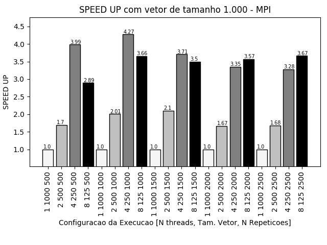
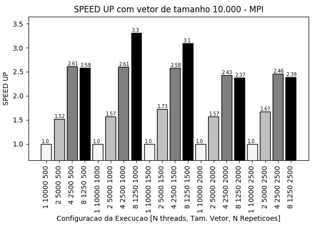
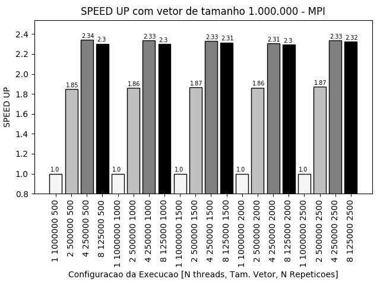

**Nome:** Bruno da Silva Alves.

**Disciplina:** elc139-2019a (Programação Paralela).

**Programas desenvolvidos:** [parte1.c](parte1/parte1.c), [parte2.c](parte2.c), [mpi_errado1.c](mpi_errado1.c), [mpi_errado2.c](mpi_errado2.c).

**Descrição do Hardware:**

Dell Inspiron 15R (7520)
2 Cores com 2 threads por cores
Intel(R) Core(TM) i5-3230M (Intel Core IvyBridge processor)
Freq. Proc. = ~3.00GHz
Memória = 7852.04 MB (Cache L1: 2x 32kB, Cache L2: 2x 256kB, Cache L3: 1x 3MB)
Ubuntu 18.04.1 LTS

-----------------------------

## Parte 1:

**Código:** [parte1.c](parte1/parte1.c)

**Resutados:** [results.csv](parte1/results.csv)

--------------

## Parte 2:

**Código:** [parte2.c](parte2.c)

---------------

## Parte 3:

**Código:** [mpi_errado1.c](mpi_errado1.c)

Explicação: O erro se encontrava na definição do valor da tag, o qual deve ser o mesmo tanto no remetente quanto no destinatário.

**Código:** [mpi_errado2.c](mpi_errado2.c)

Explicação: Todos os processos devem chamar a função  MPI_Finalize() antes de finalizar.

> Notes: All processes must call this routine before exiting. The number of processes running after this routine is called is undefined; it is best not to perform much more than a return rc after calling MPI_Finalize.

>Thread and Signal Safety: The MPI standard requires that MPI_Finalize be called only by the same thread that initialized MPI with either MPI_Init or MPI_Init_thread.

Fonte: https://www.mpich.org/static//docs/v3.0.x/www3/MPI_Finalize.html

---------------
