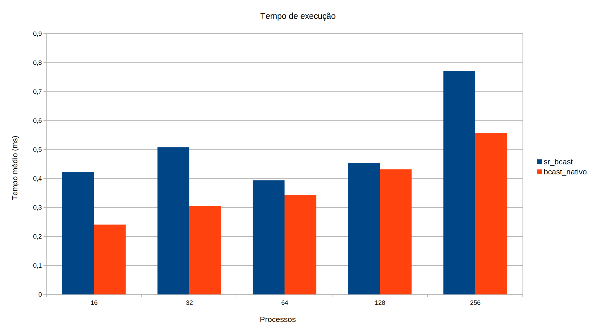
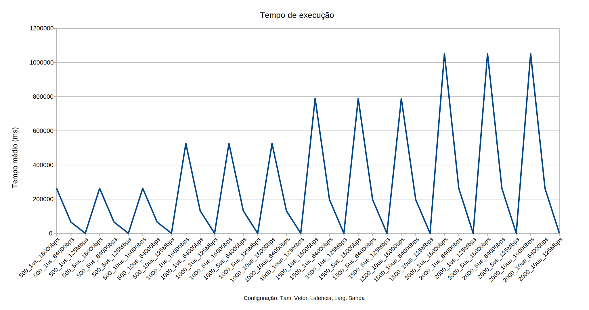

**Nome:** Bruno da Silva Alves.

**Disciplina:** elc139-2019a (Programação Paralela).

**Descrição do Hardware:**

Dell Inspiron 15R (7520)
2 Cores com 2 threads por cores
Intel(R) Core(TM) i5-3230M (Intel Core IvyBridge processor)
Freq. Proc. = ~3.00GHz
Memória = 7852.04 MB (Cache L1: 2x 32kB, Cache L2: 2x 256kB, Cache L3: 1x 3MB)
Ubuntu 18.04.1 LTS

-----------------------------

## Parte 1:

**Código 1:** [sr_bcast](sr_bcast.c).

**Código 2:** [bcast_nativo](bcast_nativo.c).

**Código python para executar os testes:** [exec](exec.py).

Gráfico das execuções (média de 50 execuções para cada tempo):

--------------

## Parte 2:

**Código:** [avg](avg.c).

**Código python para executar os testes:** [exec_parte2](exec_parte2.py).

Gráfico das execuções (média de 20 execuções para cada tempo):

